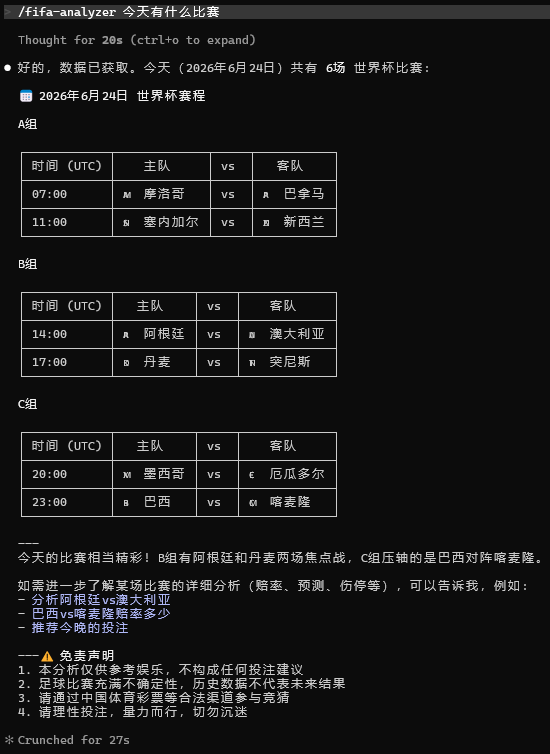
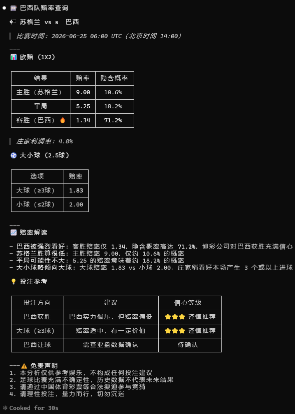
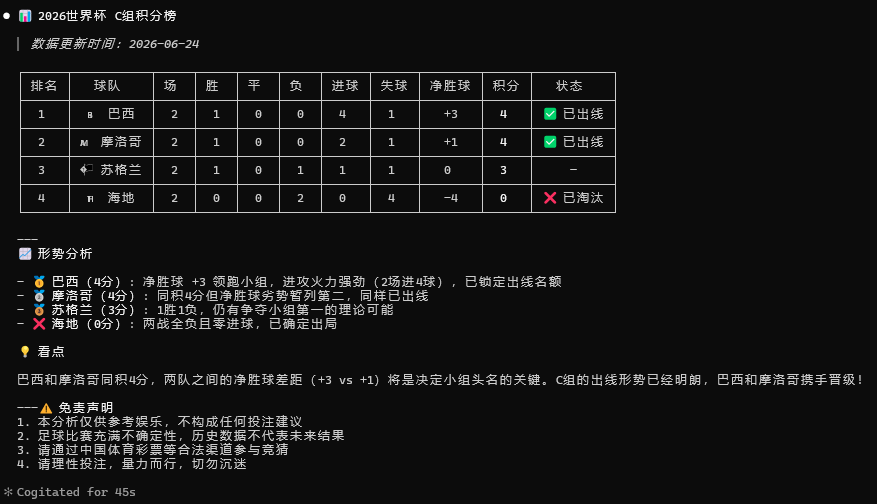
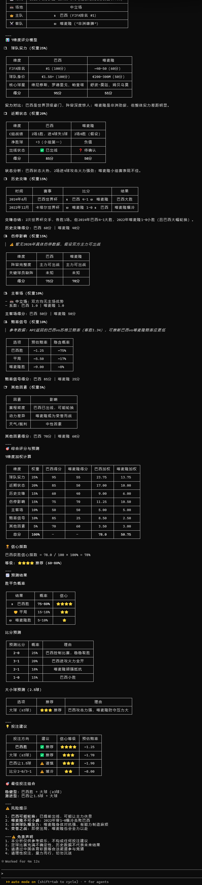

# FIFA Analyzer - 世界杯足彩分析技能

[](https://www.python.org/downloads/)
[](LICENSE)
[](https://cursor.com)
[](https://trae.ai)
[](https://claude.ai)
[](https://codeium.com)

🏆 **2026 世界杯专业足彩分析工具** — 跨平台 AI Agent 技能，兼容 Cursor / Trae / Claude Code / Windsurf / OpenClaw / Hermes 等主流 AI 编程助手

## ✨ 功能特性

### 数据获取
- 📊 **实时赛程** - 获取今日/明日/指定日期的世界杯比赛
- 💰 **完整赔率** - 欧赔(1X2)、亚盘、大小球，数据来自 ESPN/DraftKings
- 📈 **积分榜** - 12个小组实时排名，出线形势一目了然
- 🤝 **历史交锋** - 两队历史对阵记录
- 🏥 **伤停信息** - 球队伤病/停赛情况

### 智能分析
- 🧠 **7维度评分模型** - 实力/状态/交锋/伤停/主客场/赔率/其他
- 🎯 **14种意图识别** - 自然语言理解，精准匹配分析需求
- 📋 **专业报告** - 14种格式化输出模板
- 💡 **投注建议** - 基于多维度数据的智能推荐

### 技术特性
- 🐍 **Python 驱动** - 使用 requests + BeautifulSoup，稳定可靠
- ⚡ **ESPN API** - 免费、稳定、数据丰富的官方数据源
- 💾 **智能缓存** - 分级缓存策略，减少重复请求
- 🔄 **优雅降级** - 多数据源自动切换，确保服务可用

## 🚀 快速开始

### 前置要求

- Python 3.8+
- 任意支持 skill/plugin 的 AI Agent 平台

### 安装

```bash
# 克隆项目
git clone https://github.com/dingge001/fifa-analyzer.git
cd fifa-analyzer

# 安装 Python 依赖
pip install -r .claude/skills/fifa-analyzer/scripts/requirements.txt
```

### 平台兼容

| 平台 | 调用方式 | 说明 |
|------|----------|------|
| **Cursor** | Agent 模式直接对话 | 将 skill 目录放入 `.cursor/skills/` |
| **Trae** | 插件模式 | 放入 Trae 插件目录 |
| **Claude Code** | `/fifa` 或自然语言 | 放入 `.claude/skills/` |
| **Windsurf** | Agent 对话 | 放入 `.windsurf/skills/` |
| **OpenClaw** | 自然语言触发 | 放入对应 skill 目录 |
| **Hermes** | 自然语言触发 | 放入对应 skill 目录 |

### 使用

在任意 AI Agent 中直接输入：

```
/fifa 今天有什么比赛
/fifa 分析巴西vs德国
/fifa 推荐今晚的投注
/fifa C组积分榜
/fifa 法国赢球赔率多少
```

或直接输入自然语言：

```
今天有什么比赛？
帮我分析一下明天的小组赛
西班牙和法国历史交锋战绩如何？
谁最可能夺冠？
```

> 💡 **提示**：不同平台的 skill 加载路径可能不同，请参考各平台文档将本项目放入正确的 skill/plugin 目录。

##  效果展示

### 今日比赛



*查询当日世界杯赛程，按小组分组展示，附形势点评和后续分析建议*

### 赔率分析



*欧赔(1X2)、大小球完整赔率，隐含概率计算，投注建议含信心等级*

### 小组积分榜



*实时积分榜含净胜球、出线状态，附形势分析和看点提炼*

### 单场预测报告



*完整单场分析：实力对比、历史交锋、赔率信号、7维度评分、比分预测*

## 📖 命令示例

### 查询赛程

```bash
# 今日比赛
/fifa 今天有什么比赛

# 明日比赛
/fifa 明天有哪些世界杯比赛

# 指定日期
/fifa 6月28日有什么比赛
```

### 赔率分析

```bash
# 单场赔率
/fifa 巴西赢球赔率多少

# 盘口走势
/fifa 分析盘口变化
```

### 数据查询

```bash
# 积分榜
/fifa C组积分榜
/fifa 各组排名

# 球队分析
/fifa 分析阿根廷实力

# 历史交锋
/fifa 法国和德国历史交锋
```

### 投注建议

```bash
# 单场预测
/fifa 分析法国vs德国

# 多场推荐
/fifa 推荐今晚的投注
/fifa 有什么值得买的
```

## 🏗️ 项目结构

```
fifa-analyzer/
├── .claude/
│   └── skills/
│       └── fifa-analyzer/
│           ├── SKILL.md                    # 技能核心定义
│           ├── references/                 # 参考知识库
│           │   ├── data-sources.md         # 数据源配置
│           │   ├── analysis-model.md       # 分析模型算法
│           │   ├── output-templates.md     # 输出模板
│           │   ├── odds-guide.md           # 盘口解读指南
│           │   └── world-cup-2026.md       # 世界杯信息
│           ├── scripts/                    # Python 脚本
│           │   ├── fetch_matches.py        # 主数据获取（ESPN API）
│           │   ├── fetch_okooo.py          # 澳客网数据
│           │   ├── cache_manager.py        # 缓存管理
│           │   └── requirements.txt        # 依赖
│           └── data/                       # 本地缓存
│               ├── matches/
│               ├── odds/
│               ├── schedules/
│               └── head-to-head/
├── README.md
├── LICENSE
└── .gitignore
```

## 📊 数据源

| 数据源 | 用途 | 状态 |
|--------|------|------|
| **ESPN API** | 赛程/比分/赔率/积分榜 | ✅ 主数据源 |
| **DraftKings** | 赔率数据（通过ESPN） | ✅ 集成 |
| **澳客网** | 中文赔率/专家推荐 | ✅ 补充 |
| **Sofascore** | 球员评分/阵容 | ⚠️ API受限 |
| **Transfermarkt** | 球员身价/伤停 | 📝 计划中 |

## 🧠 分析模型

### 7维度评分体系

| 维度 | 权重 | 说明 |
|------|------|------|
| 球队实力 | 25% | FIFA排名 + 身价 + 阵容深度 |
| 近期状态 | 20% | 近10场胜率/进失球 |
| 历史交锋 | 15% | 近5-10次对阵记录 |
| 伤停影响 | 15% | 核心球员缺阵评估 |
| 主客场 | 10% | 主场优势系数 |
| 赔率信号 | 10% | 欧赔隐含概率 + 亚盘水位 |
| 其他因素 | 5% | 天气/裁判/赛程密度 |

### 信心指数

```
信心指数 = |主队总分 - 客队总分| / 20 × 100%

投注建议等级：
⭐⭐⭐⭐⭐ 强烈推荐 (>80%)
⭐⭐⭐⭐   推荐 (60-80%)
⭐⭐⭐     谨慎推荐 (40-60%)
⭐⭐       观望 (20-40%)
⭐         不建议 (<20%)
```

## 🔧 开发指南

### 本地测试

```bash
# 获取今日比赛
python .claude/skills/fifa-analyzer/scripts/fetch_matches.py today

# 获取赔率
python .claude/skills/fifa-analyzer/scripts/fetch_matches.py odds --team Brazil

# 查看积分榜
python .claude/skills/fifa-analyzer/scripts/fetch_matches.py standings

# 缓存管理
python .claude/skills/fifa-analyzer/scripts/cache_manager.py status
python .claude/skills/fifa-analyzer/scripts/cache_manager.py clean
```

### 添加新数据源

1. 在 `scripts/` 下创建新的抓取脚本
2. 在 `references/data-sources.md` 中配置 API 端点
3. 在 `SKILL.md` 中更新数据获取指南

### 自定义分析模型

修改 `references/analysis-model.md` 中的权重和评分规则。

## 📝 更新日志

### v1.0.0 (2026-06-24)

- ✨ 初始版本发布
- 🎯 支持14种用户意图
- 📊 ESPN API 集成
- 💰 完整赔率数据（欧赔/亚盘/大小球）
- 📈 12个小组积分榜
- 🧠 7维度评分模型
- 💾 智能缓存系统

## 🤝 贡献

欢迎提交 Issue 和 Pull Request！

1. Fork 本仓库
2. 创建特性分支 (`git checkout -b feature/AmazingFeature`)
3. 提交更改 (`git commit -m 'Add some AmazingFeature'`)
4. 推送到分支 (`git push origin feature/AmazingFeature`)
5. 开启 Pull Request

## ⚠️ 免责声明

1. 本工具仅供学习和娱乐用途，不构成任何投注建议
2. 足球比赛充满不确定性，历史数据不代表未来结果
3. 请通过中国体育彩票等合法渠道参与竞猜
4. 请理性投注，量力而行，切勿沉迷
5. 使用者需自行承担所有风险和责任

## 📄 许可证

本项目采用 MIT 许可证 - 详见 [LICENSE](LICENSE) 文件

## 🙏 致谢

- [ESPN](https://www.espn.com/) - 提供稳定的比赛数据 API
- [Cursor](https://cursor.com) / [Trae](https://trae.ai) / [Claude Code](https://claude.ai) / [Windsurf](https://codeium.com) - AI 编程助手生态
- 所有贡献者和支持者

## 📮 联系方式

- GitHub Issues: [提交问题](https://github.com/dingge001/fifa-analyzer/issues)
- Email: your-email@example.com

---

**⭐ 如果这个项目对你有帮助，请给个 Star 支持一下！**
